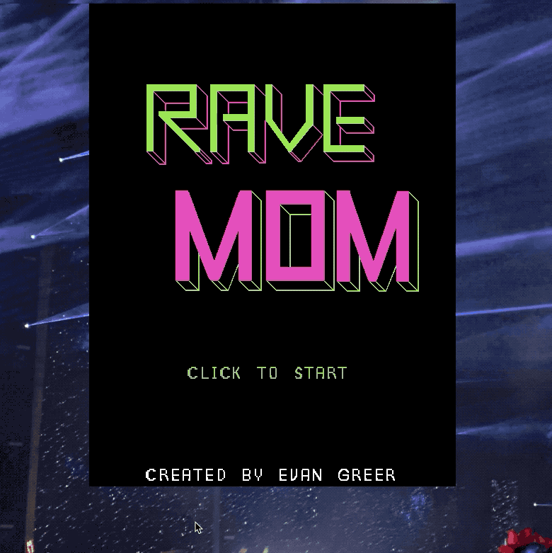

# Rave Mom: Phaser Game

Description:

Rave mom is a one player survival game. You are your squad's only hope! Feed them water to score points. Avoid the festival lasers or you will be knocked out by the intense bass music!

How to start game:

To run the game locally fork and clone "rave-mom-app" along with the corresponding backend built in "rave-mom-api".
Run "bundle install" to install the appropriate gems.
Run the rails server using the command "rails s" and run the front end using lite-server or equivalent.

The game will be hosted on Heroku and Google Firebase soon.

Built With:

Phaser 3, JavaScript, Ruby (2.6.1), Rails (6.0.2), postgresql 12, Asesprite (v1.2.17)

Authors:

Evan Greer

Acknowledgments:

Pipoya free RPG sprites (https://pipoya.itch.io/pipoya-free-rpg-character-sprites-32x32/devlog/108211/add-japanese-school-characters), Ahmed Gaber for the phaser 3 help (https://github.com/LimitToInfinity), Unsplash (https://unsplash.com/)

